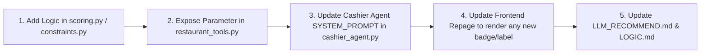

# THEATOM LLM & VOICE INTEGRATION WITH DETERMINISTIC RECOMMENDATION ENGINE
# `LLM_RECOMMEND.md` — Authoritative Architectural & Implementation Blueprint

---

## 1. Executive Summary & Core Principle

In TheAtom Kiosk platform, the system relies on a **strict separation of concerns** between the **Language Model (LLM)** and the **Recommendation Engine**:

```
┌────────────────────────────────────────────────────────────────────────┐
│                        CONVERSATIONAL LAYER (LLM)                      │
│  • Role: Customer Understanding, Speech-to-Intent, Dialogue Navigation │
│  • Rule: NEVER invents products, NEVER guesses prices, NEVER calculates│
│          recommendations in free-form text.                            │
└────────────────────────────────────┬───────────────────────────────────┘
                                     │
                 Calls Typed Tool: `get_recommendations(...)`
                 Passes Extracted Signals: {category, dietary_pref, ...}
                                     │
                                     ▼
┌────────────────────────────────────────────────────────────────────────┐
│                   DETERMINISTIC RECOMMENDATION ENGINE                  │
│  • Role: Commercial Truth, Sensory Synergy, Margin & Budget Safety     │
│  • Pipeline: 13 Deterministic Modules in 4 Strict Sequential Phases   │
│  • Output: Exact, auditable Top-K candidate list with visual badges.   │
└────────────────────────────────────┬───────────────────────────────────┘
                                     │
              Returns Structured JSON {priority, premium, additional}
                                     │
                                     ▼
┌────────────────────────────────────────────────────────────────────────┐
│                        KIOSK FRONTEND & VOICE DISPLAY                  │
│  • Visual: Screen syncs immediately to display cards with zero drop.   │
│  • Audio: LLM speaks a concise, grounded confirmation via Kokoro TTS.  │
└────────────────────────────────────────────────────────────────────────┘
```

> [!IMPORTANT]
> **The Golden Law**: The LLM **decides intent and user sentiment**; the Recommendation Engine **decides commercial facts and product rankings**. The LLM never hallucinates a recommendation; it only reads and presents what the 13-Module engine deterministically generates.

---

## 2. End-to-End Flow: From Spoken Utterance to Screen Visuals

When a customer speaks (e.g. *"Show me some spicy veg burgers"* or *"Add fries and a cold drink"*):

### Step 1: Voice Input & Transcription (STT)
1. Browser captures audio blob through microphone.
2. Audio is POSTed to `/stt`.
3. Multi-platform **Whisper engine** (`faster-whisper` on Windows/Linux or Mac CLI) transcribes the audio into text:
   `"Show me some spicy veg burgers"`

### Step 2: Intent & Entity Resolution (LLM Layer)
1. Text is sent to `POST /message`.
2. The Cashier Agent (`backend/services/cashier_agent.py` & `backend/services/model.py`) parses the message:
   - **Intent Identified**: Browse / Category recommendation.
   - **Entities Extracted**:
     - `category`: `"burger"`
     - `food_preference`: `"veg"` (triggers Module 1 Strict Dietary Lock)
     - `sensory_intent`: `"spicy"` (triggers Module 10 Sensory Affinity)

### Step 3: Recommendation Tool Call (Bridge)
The Agent invokes the registered tool in `backend/tools/restaurant_tools.py`:
```python
get_recommendations(
    category="burger",
    food_type="veg"
)
```
The session context permanently records `conversation_context["food_preference"] = "veg"`.

### Step 4: 13-Module Engine Execution (Deterministic Pipeline)
The engine executes its 4-phase pipeline:
1. **Phase 1 (Hard Exclusions)**:
   - **Module 1 (Dietary Lock)**: Non-veg candidates are eradicated instantly.
   - **Module 7 (Cart Exclusion)**: Items already in cart are removed.
2. **Phase 2 (Budget & Margin)**:
   - **Module 5**: Enforces 1.5x anchor price ceilings.
   - **Module 9**: Applies tiered margin boosts.
3. **Phase 3 (Sensory Scoring)**:
   - **Module 10**: Boosts spicy items (e.g., *Peri Peri Paneer*).
   - **Module 2**: Enforces texture diversity (prevents potato-on-potato repetition).
4. **Phase 4 (MMR Diversity)**:
   - Re-ranks candidates to ensure top-tier variety.

### Step 5: Screen Sync & Kiosk Visuals
The backend returns a unified `KioskResponse`:
```json
{
  "screen": "recommended_burgers",
  "message": "I've pulled up our best spicy vegetarian burgers for you on screen.",
  "cart": [...],
  "_last_kiosk_response": {
    "screen": "recommended_burgers",
    "action": "navigate",
    "data": {
      "priority": [{"id": 7, "name": "Veg Whopper", ...}],
      "premium": [{"id": 14, "name": "Peri Peri Paneer", ...}],
      "additional": [...]
    }
  }
}
```
1. **Frontend Visuals**: `KioskContext.jsx` receives `screen: "recommended_burgers"`, updates `recommendationData`, and navigates the user to [`Burgerrepage.jsx`](file:///C:/Users/Hemanth%20Raju%20N/Downloads/MLE%20git%20branch/Intelligent-agent/frontend/src/Pages/Burgerrepage.jsx), which renders the 8 cards immediately without blank cards.
2. **Audio Spoken**: The message is sent to Kokoro TTS (`/tts`) which plays: *"I've pulled up our best spicy vegetarian burgers for you on screen."*

---

## 3. File Map: Where & What to Change

When enhancing recommendations, adding new modules, or adjusting LLM behavior, use this directory guide:

| Layer | File Path | What Lives Here | How to Modify |
| :--- | :--- | :--- | :--- |
| **System Prompt** | `backend/services/cashier_agent.py` | `SYSTEM_PROMPT` string (instructions given to the LLM) | Add rules instructing the agent when to call `get_recommendations` and how to handle dietary switches. |
| **LLM Model Adapter** | `backend/services/model.py` | `GeminiRestModel` & fast-path intent heuristics | Adjust fast-path heuristics (`_extract_intent_and_action`) for ultra-low latency response before LLM inference. |
| **Agent Tools** | `backend/tools/restaurant_tools.py` | Tool bindings exposed to the LLM (`get_recommendations`, `open_category`, `get_menu_item_details`) | Add or update parameters (e.g. passing `flavor`, `texture`, or `budget_tier` to the recommendation engine). |
| **Recommendation Gateway** | `backend/services/recommendation.py` | `get_agent_recommendations(...)` bridge function | Maps agent tool arguments into the 13-Module scoring engine. |
| **Deterministic Engine** | `backend/app/intelligence/recommendation/` | Core 13-Module Pipeline (`scoring.py`, `constraints.py`, `retrieval.py`, `diversity.py`) | Modify scoring formulas, dietary gates, price ceilings, and MMR diversity logic. |
| **API Message Route** | `backend/api.py` | `POST /message` endpoint | Coordinates user input, invokes `run_cashier_agent`, and attaches `_last_kiosk_response` for frontend screen navigation. |
| **Frontend State** | `frontend/src/context/KioskContext.jsx` | Kiosk state, `executeUIAction`, `foodPreference` | Listens to backend actions (`navigate`, `screen_action`) and switches pages or filters cards. |
| **Category Repages** | `frontend/src/Pages/*repage.jsx` | `Burgerrepage.jsx`, `Sidesrepage.jsx`, `Drinkrepage.jsx`, `Dessertrepage.jsx` | Renders the 8 recommendation cards with defensive fallback pools and RAM caching. |

---

## 4. Prompt Engineering Blueprint for Recommendation Integration

To keep the LLM aligned with the 13-module engine, the following principles must be maintained in `SYSTEM_PROMPT` in `backend/services/cashier_agent.py`:

```yaml
RECOMMENDATION INTEGRATION RULES FOR THE LLM:
1. DIETARY INTEGRITY:
   - If the customer says "veg", "vegetarian", or mentions religious dietary requirements:
     * Never suggest non-veg items.
     * Always pass `food_type="veg"` when calling `get_recommendations`.
     * Acknowledge the preference naturally: "Showing you our vegetarian options."

2. NEVER INVENT PAIRINGS:
   - When asked "What goes well with Whopper?", call `get_recommendations` or open product details.
   - Do not invent fictional discounts, combos, or unverified ingredients.

3. SPICY & SENSORIAL AFFINITY:
   - If the customer requests "spicy", "light", or "crispy", pass that intent to the recommendation tool.
   - Do not override the deterministic recommendation list with random manual picks.

4. DUAL-ROLE SATURATION AWARENESS:
   - If a customer already has a thick shake in their cart, understand that both Drink and Dessert roles are fulfilled. Recommend savory sides rather than sodas or ice creams.

5. CONCISE SPOKEN RESPONSES:
   - Since kiosk responses are spoken via TTS, limit confirmation messages to 1-2 short, friendly sentences.
   - Do not recite long lists of 8 items aloud — let the screen display the visual cards.
```

---

## 5. How to Handle Future Module Enhancements (Step-by-Step)

Whenever a **New Module** (e.g., Module 14: Weather/Rain Dynamic Cold Drink Dampener) is added:



1. **Implement Core Engine Logic**: Add the module into `backend/app/intelligence/recommendation/scoring.py` or `constraints.py`.
2. **Update Tool Contract**: If the LLM needs to supply an explicit signal, add the parameter to `get_recommendations` in `backend/tools/restaurant_tools.py`.
3. **Update LLM System Prompt**: Document the new capability in `backend/services/cashier_agent.py` under `SYSTEM_PROMPT`.
4. **Update Frontend UI**: Ensure the relevant page (`ProductPage.jsx`, `CartPage.jsx`, etc.) displays any resulting badge.
5. **Update Documentation**: Record the change in `LOGIC.md` and this file (`LLM_RECOMMEND.md`).

---

## 6. Safe Git Workflow: How to Pull `master` Without Overwriting Refinements

When you need to pull updates from `master` while protecting your recommendation and refinement work:

```powershell
# Step 1: Ensure all current working changes are committed to your branch
cd "C:\Users\Hemanth Raju N\Downloads\MLE git branch\Intelligent-agent"
git add -A
git commit -m "chore: save local refinement progress before sync"

# Step 2: Fetch latest master from remote
git fetch origin master

# Step 3: Rebase or merge cleanly
# Option A: Merge master into MLE (safest and easiest to resolve)
git merge origin/master

# If git flags any merge conflict in files you changed:
# Review the conflicting file, keep your recommendation logic, then:
# git add <conflicted-file>
# git commit -m "merge: resolve sync with master"

# Step 4: Verify the build and tests
cd frontend
npm run build
cd ..\backend
backend\venv\Scripts\python.exe -m py_compile api.py

# Step 5: Push your updated branch
git push origin MLE
```

> [!TIP]
> Keeping recommendation logic modular (in `app/intelligence/recommendation/` and `tools/restaurant_tools.py`) prevents conflicts with other teammates working on speech or UI components.
